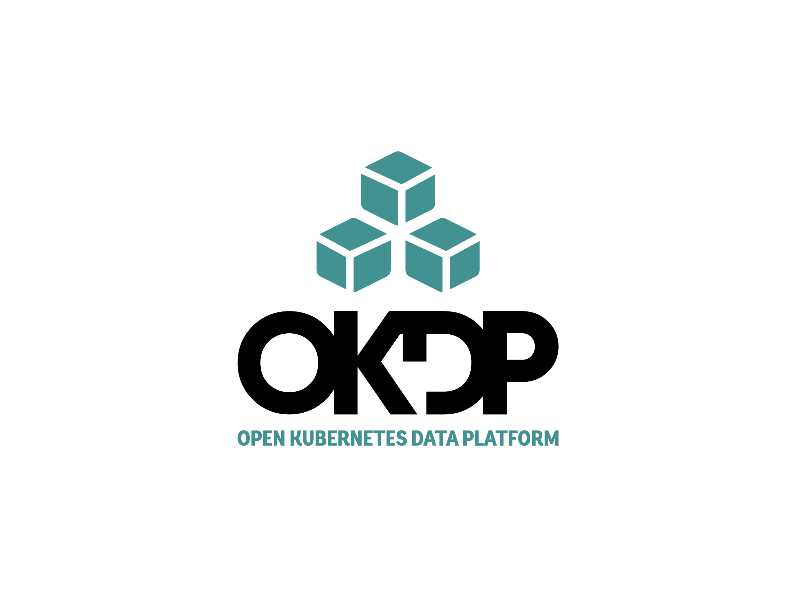

[](https://github.com/okdp/charts/actions/workflows/ci.yml)
[](https://github.com/okdp/charts/actions/workflows/release-please.yml)
[](http://www.apache.org/licenses/LICENSE-2.0)

<p align="center">
    
</p>


Provides a collection of [helm](https://helm.sh/) charts used by the [okdp](https://okdp.io) Platform.

## TL;DR

```console
$ helm repo add odkp https://okdp.github.io/charts/
$ helm install my-release odkp/[chart]
```

## Requirements

- Kubernetes cluster
- [Helm](https://helm.sh/) installed

> [!NOTE]
> An OKDP sandbox, with all these helm charts installed, is under development and you can use it once released.
> 